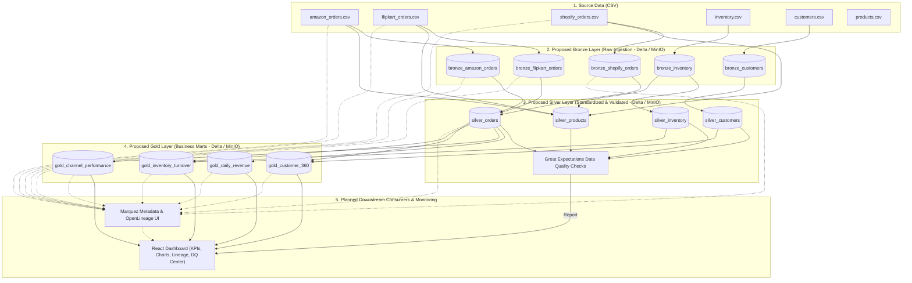

# CartCo Unified Commerce Lakehouse

A multi-channel retail Lakehouse architecture planned for **CartCo**. The proposed platform will consolidate fragmented transaction and inventory data from **Shopify, Amazon, Flipkart, and physical retail outlets** into a standardized, audited, and observable Single Source of Truth (SSOT) to eliminate operational blind spots and inventory discrepancies.

---

## Proposed Architecture & Data Flow

The project will implement a three-tier **Medallion Lakehouse Architecture** on top of MinIO (S3-compatible object storage) using Delta Lake and PySpark:

1. **Bronze (Raw Ingestion)**: Will perform raw, no-transformation append loads from Landing to Delta tables. Data will be partitioned by `ingest_date` (system ingestion date).
2. **Silver (Cleaned & Standardized)**: Will enforce schema types, clean fields (e.g., email trims, name casing), normalize multi-channel date styles, and deduplicate orders. It will perform inline Great Expectations quality assertions.
3. **Gold (Business Aggregations)**: Will provide aggregated analytical tables modeled for BI dashboards: `gold_daily_revenue`, `gold_channel_performance`, `gold_customer_360` (LTV, category preferences), and `gold_inventory_turnover` (turnover ratios, stagnant stock metrics).

---

## Selected Technology Stack

The platform will leverage the following technology stack:

*   **MinIO**: S3-compatible local object storage for the data lake.
*   **Delta Lake**: Transactional table format ensuring ACID compliance and schema enforcement.
*   **PySpark**: Distributed processing engine for executing cleaning and analytical aggregations.
*   **Airflow**: Orchestration engine for workflow scheduling and monitoring pipeline jobs.
*   **Great Expectations**: Testing framework for data quality validation and automated audit report generation.
*   **OpenLineage / Marquez**: Metadata model and visual repository for data lineage tracing.
*   **FastAPI**: Backend REST API exposing curated analytical datasets to the frontend.
*   **React**: Modern user interface for visualizing business KPIs, data quality reports, and pipeline runs.
*   **Docker**: Local multi-container virtualization for standardizing developer setups.

---

## Current Status

### Week 1 Progress:

*   Repository initialized
*   Project scope defined
*   Architecture design completed
*   Technology stack finalized
*   Development roadmap established

### Upcoming:

*   Synthetic data generation
*   Bronze layer ingestion
*   Delta Lake storage setup
*   Airflow orchestration

---

## Planned Deliverables

*   Medallion Lakehouse Architecture
*   Bronze, Silver, Gold Data Layers
*   Apache Airflow Orchestration
*   Great Expectations Data Quality Checks
*   OpenLineage + Marquez Observability
*   FastAPI Backend
*   React Analytics Dashboard
*   Dockerized Deployment
*   CI/CD with GitHub Actions

---

## Internship Roadmap (5-Week Implementation)

### Week 1: Requirements Analysis & Docker Architecture
*   Define storage topology and network mapping for MinIO, Airflow, and Marquez.
*   Standardize local environment setups.
*   **Milestone**: Docker Compose environment spinning up successfully.

### Week 2: Data Generation & Ingestion (Bronze)
*   Implement self-contained retail dataset generator.
*   Configure Spark Delta connectors to MinIO.
*   Write PySpark jobs to ingest raw data into Bronze tables.
*   **Milestone**: 100,000+ records successfully loaded to Bronze.

### Week 3: Cleaning, Standardisation & Data Quality (Silver)
*   Standardize date parsers and clean strings.
*   Deduplicate orders and handle null records.
*   Integrate Great Expectations with PySpark dataset validations.
*   **Milestone**: Data cleaning jobs executing and writing clean Silver records.

### Week 4: Business Intelligence Aggregations (Gold)
*   Formulate window analytical functions in Spark to compute customer profiles (LTV, favored channels).
*   Implement stock turnover ratios and classification metrics.
*   Write scheduled Airflow DAGs.
*   **Milestone**: Gold marts updated and validated.

### Week 5: Dashboard Visualization & Lineage Explorer
*   Build premium dark-theme React SPA using Tailwind CSS, Recharts, and Lucide Icons.
*   Design high-performance FastAPI backend API with Delta Lake S3 integration.
*   Implement responsive visual layouts, interactive charts, and data lineage mapping.
*   **Milestone**: Full platform visualization working, recruiter-ready presentation complete.

---

## Git Commit Recommendations

*   **Feat**: Implement `data_generator.py` for multi-channel commerce simulation.
*   **Docker**: Set up PostgreSQL, Airflow, and MinIO multi-service compose network.
*   **Spark**: Implement Bronze ingestion job and Silver standardization pipelines.
*   **Quality**: Integrate Great Expectations inline validation suite for Silver.
*   **Gold**: Build analytical SQL aggregates for Customer 360 and Inventory.
*   **Dashboard**: Implement Streamlit application pages for executive metrics.
*   **Test**: Add unit and integration test coverage for PySpark jobs.
