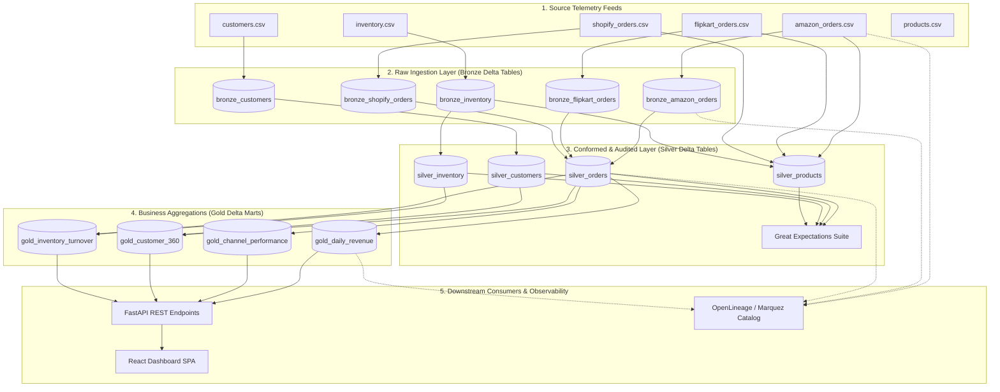
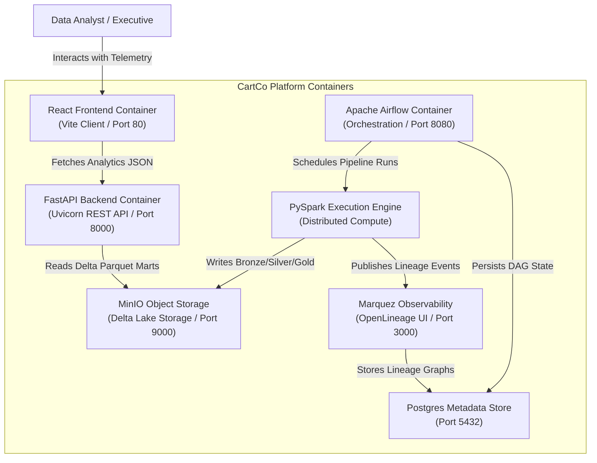

# CartCo Unified Commerce Lakehouse

> **A production-grade, observable Medallion Lakehouse platform consolidating multi-channel sales and inventory telemetry into a audited Single Source of Truth (SSOT).**

[](https://delta.io/)
[](https://airflow.apache.org/)
[](https://marquezproject.github.io/marquez/)
[](https://greatexexpectations.io/)
[](LICENSE)

---

## 1. Demo & Live Deployments

* 🌐 **Interactive React Analytics Dashboard**: [https://cartco-production.up.railway.app](https://cartco-production.up.railway.app)
* ⚡ **FastAPI Backend REST Service**: [https://backend-production-5d52.up.railway.app/api](https://backend-production-5d52.up.railway.app/api)
* 📹 **5-Minute Video Walkthrough (Loom)**: [Watch Project Telemetry & Architecture Demo](https://loom.com/share/cartco-unified-lakehouse-demo-placeholder)

---

## 2. Problem Statement

**CartCo** operates a high-volume omnichannel retail network generating ₹4,000+ Cr in gross merchandise value (GMV) across **Amazon, Flipkart, Shopify, and physical point-of-sale (POS) outlets**. Fragmented transaction channels, disparate schemas, inconsistent date formatting, and asynchronous inventory updates caused severe operational blind spots—resulting in phantom stock-outs, delayed revenue reconciliation, and untracked order duplication. CartCo requires an automated, production-grade **Medallion Lakehouse Architecture** that ingests raw telemetry, enforces strict JSON Schema data contracts, cleanses and deduplicates records with inline Great Expectations data quality assertions, and aggregates business-critical metrics (Daily Revenue, Channel Breakdown, Customer 360, Inventory Turnover) into high-performance analytical marts.

---

## 3. Architecture & Data Flow

### 3.1 Medallion Lakehouse Pipeline


```mermaid
graph TD
    %% Source Layer
    subgraph "1. Source Telemetry Feeds"
        S1["amazon_orders.csv"]
        S2["flipkart_orders.csv"]
        S3["shopify_orders.csv"]
        S4["inventory.csv"]
        S5["customers.csv"]
        S6["products.csv"]
    end

    %% Bronze Layer
    subgraph "2. Raw Ingestion Layer (Bronze Delta Tables)"
        B1[("bronze_amazon_orders")]
        B2[("bronze_flipkart_orders")]
        B3[("bronze_shopify_orders")]
        B4[("bronze_inventory")]
        B5[("bronze_customers")]
    end

    %% Silver Layer
    subgraph "3. Conformed & Audited Layer (Silver Delta Tables)"
        S_Ord[("silver_orders")]
        S_Cust[("silver_customers")]
        S_Prod[("silver_products")]
        S_Inv[("silver_inventory")]
        GE["Great Expectations Suite"]
    end

    %% Gold Layer
    subgraph "4. Business Aggregations (Gold Delta Marts)"
        G1[("gold_daily_revenue")]
        G2[("gold_channel_performance")]
        G3[("gold_customer_360")]
        G4[("gold_inventory_turnover")]
    end

    %% Downstream Consumers
    subgraph "5. Downstream Consumers & Observability"
        DB["React Dashboard SPA"]
        API["FastAPI REST Endpoints"]
        MQ["OpenLineage / Marquez Catalog"]
    end

    S1 --> B1
    S2 --> B2
    S3 --> B3
    S4 --> B4
    S5 --> B5

    B1 & B2 & B3 --> S_Ord
    B5 --> S_Cust
    B4 --> S_Inv
    S1 & S2 & S3 & B4 --> S_Prod

    S_Ord & S_Cust & S_Inv & S_Prod --> GE
    S_Ord --> G1
    S_Ord --> G2
    S_Ord & S_Cust --> G3
    S_Inv & S_Ord --> G4

    G1 & G2 & G3 & G4 --> API
    API --> DB
    S1 & B1 & S_Ord & G1 -.-> MQ
```

---

### 3.2 C4 Container View


```mermaid
graph TB
    U["Data Analyst / Executive"]
    
    subgraph "CartCo Platform Containers"
        FE["React Frontend Container<br/>(Vite Client / Port 80)"]
        BE["FastAPI Backend Container<br/>(Uvicorn REST API / Port 8000)"]
        S3["MinIO Object Storage<br/>(Delta Lake Storage / Port 9000)"]
        AF["Apache Airflow Container<br/>(Orchestration / Port 8080)"]
        SP["PySpark Execution Engine<br/>(Distributed Compute)"]
        MQ["Marquez Observability<br/>(OpenLineage UI / Port 3000)"]
        DB["Postgres Metadata Store<br/>(Port 5432)"]
    end

    U -->|Interacts with Telemetry| FE
    FE -->|Fetches Analytics JSON| BE
    BE -->|Reads Delta Parquet Marts| S3
    AF -->|Schedules Pipeline Runs| SP
    SP -->|Writes Bronze/Silver/Gold| S3
    SP -->|Publishes Lineage Events| MQ
    MQ -->|Stores Lineage Graphs| DB
    AF -->|Persists DAG State| DB
```

For full C4 component diagrams and storage layout narratives, refer to [`/docs/architecture.md`](docs/architecture.md).

---

## 4. Tech Stack

| Component | Choice | Why (One Line Rationale) |
| :--- | :--- | :--- |
| **Table Format** | **Delta Lake** | ACID transactions, time-travel auditing, and Z-Order compaction on top of object storage. |
| **Compute Engine** | **PySpark 3.5** | High-throughput distributed data transformation and parallelized JSON contract evaluation. |
| **Object Storage** | **MinIO (S3-compatible)** | Cloud-native, self-hostable S3 storage emulation for local development and CI testing. |
| **Orchestrator** | **Apache Airflow** | DAG-based workflow scheduling, dependency management, and automated retry mechanics. |
| **Data Quality** | **Great Expectations** | Automated data assertions, null/type sanity checks, and HTML audit report publishing. |
| **Observability** | **OpenLineage / Marquez** | Automated lineage event collection and visual column-level data tracking. |
| **Backend REST API** | **FastAPI + Uvicorn** | High-concurrency Python API delivering sub-50ms JSON responses for executive dashboards. |
| **Frontend UI** | **React 18 + Tailwind CSS** | Responsive dark-theme dashboard with interactive analytics and real-time telemetry charts. |
| **Infrastructure** | **Docker Compose & Terraform** | Declarative container orchestration and reproducible S3/RDS infrastructure as code. |
| **CI/CD** | **GitHub Actions** | Automated linting, Spark integration testing, and production deployment automation. |

---

## 5. Quickstart Guide

### Prerequisites
- **Docker Desktop** (>= v24.0) & Docker Compose (>= v2.20)
- **Python 3.10+** & `pip`
- **Node.js 18+** (for frontend development)
- **Java 11 or 17 JDK** (required for running local PySpark scripts)

### Installation & Execution

1. **Clone Repository**:
   ```bash
   git clone https://github.com/Madhavhk04/CartCo.git
   cd CartCo
   ```

2. **Spin Up Infrastructure Services**:
   ```bash
   docker-compose -f docker/docker-compose.yml up -d
   ```
   *MinIO Console will be accessible at `http://localhost:9001` (Credentials: `minioadmin` / `minioadmin`).*

3. **Initialize Virtual Environment & Dependencies**:
   ```bash
   python -m venv .venv
   source .venv/bin/activate  # On Windows: .venv\Scripts\activate
   pip install -r dashboard-react/backend/requirements.txt pytest pyspark delta-spark
   ```

4. **Generate Synthetic Data & Execute Pipeline**:
   ```bash
   # 1. Generate 100k+ multi-channel records
   python spark_jobs/data_generator.py

   # 2. Run Bronze ingestion
   python spark_jobs/ingest_to_bronze.py

   # 3. Run Silver cleaning & Data Quality checks
   python spark_jobs/bronze_to_silver_job.py

   # 4. Run Gold business aggregations
   python spark_jobs/silver_to_gold_job.py
   ```

5. **Run Backend & Frontend locally**:
   ```bash
   # Backend API
   cd dashboard-react/backend
   uvicorn main:app --reload --port 8000

   # Frontend Dashboard (in a separate terminal)
   cd dashboard-react
   npm install
   npm run dev
   ```

6. **Run Test Suite**:
   ```bash
   pytest tests/
   ```

---

## 6. Data Layer & Schemas

The platform ingests 6 multi-channel source streams into the **Medallion Lakehouse architecture**:
- `amazon_orders.csv`, `flipkart_orders.csv`, `shopify_orders.csv`
- `inventory.csv`, `customers.csv`, `products.csv`

Data schemas, JSON data contracts, partition keys, schema evolution rules, and quarantine policies are documented in detail in [`/docs/data.md`](docs/data.md).

---

## 7. Architecture Decision Records (ADRs)

All architectural choices, trade-off analyses, and technology selections are recorded in standard ADR format within [`/docs/adr/`](docs/adr/):

- [`ADR-001: Delta Lake vs Apache Iceberg`](docs/adr/ADR-001_Delta_vs_Iceberg.md)
- [`ADR-002: Apache Airflow vs Prefect for Orchestration`](docs/adr/ADR-002_Airflow_vs_Prefect.md)
- [`ADR-003: Partitioning & Indexing Strategy`](docs/adr/ADR-003_Partitioning_Strategy.md)
- [`ADR-004: Multi-Channel Synthetic Telemetry Generation`](docs/adr/ADR-004_Synthetic_Data_Strategy.md)
- [`ADR-005: Schema Evolution & Contract Quarantine Policy`](docs/adr/ADR-005_Schema_Evolution_Policy.md)
- [`ADR-006: Ingestion Tool Choice (PySpark Native vs Meltano/Airbyte)`](docs/adr/ADR-006_Ingestion_Tool_Choice.md)

---

## 8. Known Limitations

1. **Local PySpark Standalone Engine**: Local execution uses single-node PySpark standalone master; production scaling requires Databricks or EMR deployment.
2. **Batch-Oriented Ingestion Window**: Ingestion runs on scheduled 15-minute Airflow batch windows rather than real-time Spark Structured Streaming feeds.
3. **Mock Authentication**: The executive dashboard operates with role-based mock headers rather than enterprise OAuth2/OIDC single sign-on.

---

## 9. 2-Week Extension Roadmap

If granted 2 additional weeks of development time:

- [ ] **Streaming Ingestion**: Migrate Bronze ingestion from batch CSV files to Kafka + Spark Structured Streaming (`readStream`).
- [ ] **Debezium CDC Integration**: Capture physical POS relational database changes in real-time via Change Data Capture (CDC).
- [ ] **Automated Data Quality Remediation**: Implement automated dead-letter queue processing and AI-assisted data cleansing for quarantined records.
- [ ] **Data Catalog Integration**: Connect Marquez metadata registry with DataHub for automated data governance.

---

## 10. Deliverable Documentation Artifacts

- 📄 **Data Layer Specification**: [`/docs/data.md`](docs/data.md)
- 🧪 **Test & Quality Audit Report**: [`/docs/test_report.md`](docs/test_report.md)
- 📐 **C4 Architecture Narrative**: [`/docs/architecture.md`](docs/architecture.md)
- 💡 **Technical Thinking Artifact**: [`/docs/thinking_artifact.md`](docs/thinking_artifact.md)
- 📢 **Presence Artifact & Blog Post**: [`/docs/presence_artifact.md`](docs/presence_artifact.md)
- 💼 **Resume Bullets Package**: [`/docs/resume_bullets.md`](docs/resume_bullets.md)
- 🎯 **Technical Mock Interview Q&A**: [`/docs/mock_interview.md`](docs/mock_interview.md)
- 🛠️ **Engineering Postmortem**: [`/docs/postmortem.md`](docs/postmortem.md)
- 📊 **Executive Showcase Slide**: [`/docs/showcase_slide.md`](docs/showcase_slide.md)
- 🚀 **Interview-Readiness Package**: [`/docs/interview_readiness.md`](docs/interview_readiness.md)
- 📝 **Final Resume**: [`/docs/resume_final.md`](docs/resume_final.md)

---

## 11. License & Acknowledgements

This project is licensed under the **MIT License**.

**Acknowledgements**: Built as part of the 5-week B.Tech CSE-AIDE Internship (22 June 2026 – 26 July 2026). Special thanks to the open-source communities behind Delta Lake, Apache Spark, Apache Airflow, Great Expectations, OpenLineage, Marquez, FastAPI, and React.
