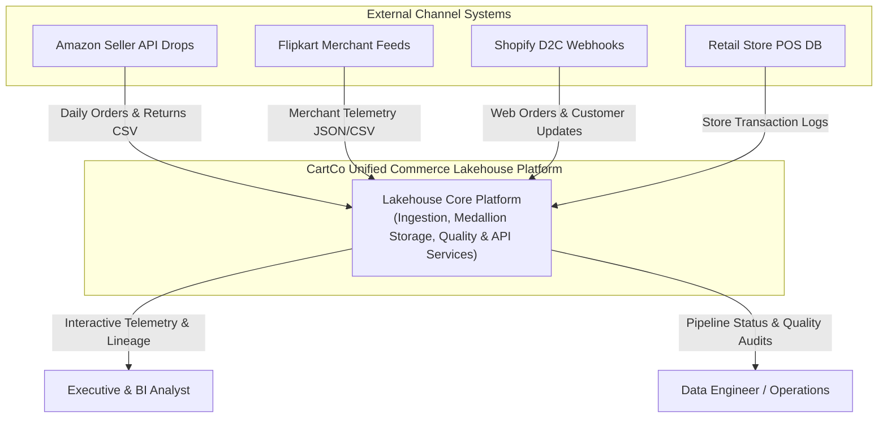
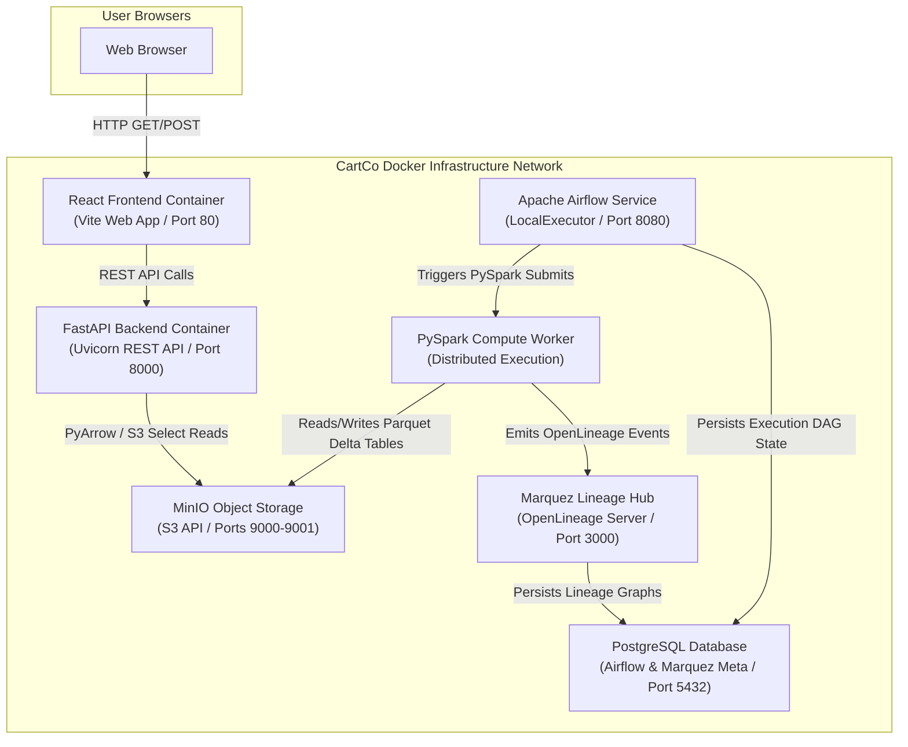

# CartCo System Architecture & Data Topology

## 1. Executive Architecture Overview

The **CartCo Unified Commerce Lakehouse** is an enterprise-grade, observable data platform engineered to consolidate fragmented retail telemetry across **Amazon India, Flipkart, Shopify D2C, and Physical Point-of-Sale (POS) outlets**. 

The platform leverages a **3-Tier Medallion Architecture** built on **Delta Lake** transaction tables and S3-compatible **MinIO** storage, orchestrated by **Apache Airflow**, validated inline with **Great Expectations**, tracked via **OpenLineage / Marquez**, exposed via a high-performance **FastAPI** backend, and visualized through a modern **React SPA**.

---

## 2. C4 Model Architecture Specifications

### 2.1 C4 Level 1: System Context View

The context view details how external actors and data providers interact with the CartCo Lakehouse system.



---

### 2.2 C4 Level 2: Container Architecture View

The container diagram illustrates the runtime container boundaries, port mappings, and inter-service communications.



#### Container Network Topology & Port Mapping
| Container Service | Primary Technology | Host Port | Internal Port | Purpose |
| :--- | :--- | :--- | :--- | :--- |
| `cartco-frontend` | React 18 / Nginx | `80` | `80` | Executive SPA for BI & Lineage |
| `cartco-backend` | FastAPI / Uvicorn | `8000` | `8000` | Analytics API serving JSON |
| `cartco-minio` | MinIO Object Store | `9000 / 9001` | `9000 / 9001` | Delta Lake Parquet Table Storage |
| `cartco-airflow` | Apache Airflow 2.8 | `8080` | `8080` | Workflow DAG Scheduling |
| `cartco-marquez` | Marquez Observability | `3000` | `3000` | OpenLineage Visual Lineage Explorer |
| `cartco-postgres` | PostgreSQL 15 | `5432` | `5432` | Metadata Repository |

---

## 3. Storage Topology & Medallion Pipeline Design

The system implements the **Medallion Architecture** on top of MinIO S3 buckets:

```
s3a://lakehouse/
├── landing/                    # Raw un-ingested source drops
│   ├── amazon/
│   ├── flipkart/
│   ├── shopify/
│   └── pos/
├── bronze/                     # Raw append-only Delta tables
│   ├── bronze_amazon_orders/
│   ├── bronze_flipkart_orders/
│   └── bronze_shopify_orders/
├── silver/                     # Cleaned, standardized, de-duplicated Delta tables
│   ├── silver_orders/
│   ├── silver_customers/
│   ├── silver_products/
│   └── silver_inventory/
├── gold/                       # Aggregated analytical marts
│   ├── gold_daily_revenue/
│   ├── gold_channel_performance/
│   ├── gold_customer_360/
│   └── gold_inventory_turnover/
└── quarantine/                 # Isolated invalid records
    └── invalid_orders/
```

---

## 4. Metadata Observability & Lineage Tracking

Data lineage is captured automatically using **OpenLineage** integration within PySpark jobs (`spark_utils.py`). 
Every Spark transformation job emits an OpenLineage event payload containing:
- Input dataset namespace and facets (source path, schema).
- Output dataset namespace and facets (destination Delta path, updated row counts).
- Job metadata (job name, run ID, execution timestamp).

Events are dispatched directly to **Marquez** (`http://localhost:3000`), allowing engineers and auditors to inspect column-level lineage and track pipeline dependencies from source CSV down to Gold aggregation marts and FastAPI backend endpoints.
