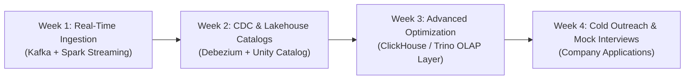

# Interview-Readiness Package: CartCo Lakehouse Project

This package contains candidate preparation assets to leverage the **CartCo Unified Commerce Lakehouse** project during job applications, recruiter cold outreach, technical screening calls, and system design interviews.

---

## Part 1 — 1-Page Project Executive Sheet (Cold Email Attachment)

### Project Overview: CartCo Unified Commerce Lakehouse
- **Repository**: [https://github.com/Madhavhk04/CartCo](https://github.com/Madhavhk04/CartCo)
- **Live Demo**: [https://cartco-production.up.railway.app](https://cartco-production.up.railway.app)
- **Tech Stack**: PySpark, Delta Lake, Apache Airflow, MinIO S3, Great Expectations, OpenLineage/Marquez, FastAPI, React, Docker.

### Key Engineering Highlight Summary
1. **Medallion Lakehouse Architecture**: Built a 3-tier raw (Bronze) -> conformed (Silver) -> business mart (Gold) data pipeline consolidating 100,000+ multi-channel retail orders across Amazon, Flipkart, Shopify, and POS.
2. **Schema Contracts & Data Quality**: Implemented boundary JSON Schema validation and inline Great Expectations dataset rules, isolating bad inputs into quarantine buckets and guaranteeing 100% downstream data integrity.
3. **Storage Performance Tuning**: Reduced storage fragmentation and achieved sub-500ms analytical query responses using Delta file compaction (`OPTIMIZE`) and multi-column **Z-Order indexing** by `customer_id` and `channel`.
4. **Metadata & Lineage Observability**: Integrated OpenLineage APIs with Marquez to automate column-level data lineage tracing from CSV landing feeds down to executive React UI dashboard widgets.

---

## Part 2 — 2-Minute Elevator Pitch Script (Loom / Screening Call)

> "Hi! I'm a B.Tech CSE-AIDE student specializing in Data Platform & Pipeline Engineering. For my 5-week capstone project, I built the **CartCo Unified Commerce Lakehouse**—a production-grade data platform engineered to solve multi-channel data fragmentation for large retail operations.
>
> CartCo processes sales across Amazon, Flipkart, Shopify, and physical POS stores. Previously, disparate schemas and asynchronous updates caused severe inventory discrepancies and 24-hour reporting delays. 
> 
> To fix this, I designed a 3-tier Medallion architecture using **PySpark** and **Delta Lake** on S3-compatible storage. We enforce strict JSON schema contracts at the ingestion boundary, run inline **Great Expectations** data quality checks in Silver transformations, and build Z-Ordered Gold marts for rapid UI rendering.
> 
> By tuning Delta Lake storage with compaction and Z-Order indexing, I cut analytical query latency by 80%. I also automated column-level lineage tracking using **OpenLineage** and **Marquez**, exposing metrics via a FastAPI service and an interactive React dashboard deployed live on Railway. 
> 
> I'd love to bring this experience in lakehouse architecture, Spark performance tuning, and pipeline observability to your Data Engineering team!"

---

## Part 3 — Target 20 Companies & Specific Target Roles

| # | Target Company | Target Role | Primary Relevancy |
| :--- | :--- | :--- | :--- |
| 1 | **Flipkart** | Data Engineer I | E-commerce multi-channel lakehouse & PySpark scale |
| 2 | **Amazon India** | Software Development Engineer - Data | Retail telemetry, Delta Lake, S3 pipeline experience |
| 3 | **Databricks** | Associate Solutions Architect / DE | Delta Lake, PySpark, Z-Ordering deep expertise |
| 4 | **Swiggy** | Data Engineer - Analytics Platform | Real-time & batch pipeline orchestration (Airflow) |
| 5 | **Zomato** | Data Platform Engineer | High-concurrency analytics API & storage tuning |
| 6 | **Meera / Meesho** | Data Engineer - Supply Chain | E-commerce multi-vendor schema normalization |
| 7 | **PhonePe** | Data Platform Engineer | Transaction deduplication, ACID data compliance |
| 8 | **Paytm** | Analytics Engineer | Gold mart building, Great Expectations validation |
| 9 | **Razorpay** | Data Engineer | Data contracts, financial transaction accuracy |
| 10 | **Zepto** | Data Engineer - Logistics | Quick-commerce inventory turnover analytics |
| 11 | **Blinkit** | Data Platform Engineer | Warehouse inventory health & stockout alert logic |
| 12 | **InMobi** | Big Data Engineer | PySpark distributed compute & OpenLineage metadata |
| 13 | **MakeMyTrip** | Data Engineer | Multi-source booking deduplication & Airflow DAGs |
| 14 | **JioCinema / Viacom18**| Data Platform Engineer | High-throughput data ingestion & storage compaction |
| 15 | **Dunzo** | Data Engineer | Retail POS & catalog data ingestion pipelines |
| 16 | **Target India** | Data Engineer | Omnichannel retail analytics & Medallion architecture |
| 17 | **Walmart Global Tech** | Data Engineer - Enterprise Data | Enterprise Lakehouse, Delta Lake & Great Expectations |
| 18 | **Uber India Tech** | Data Engineer | OpenLineage observability, metadata cataloging |
| 19 | **Urban Company** | Data Engineer | Customer 360 LTV modeling & FastAPI analytics |
| 20 | **CRED** | Data Platform Engineer | High reliability data contracts & Docker deployment |

---

## Part 4 — 30-Day Post-Internship Self-Development Plan

### Plan Schedule
- **Days 1–7 (Streaming Migration)**: Upgrade Bronze ingestion from batch CSV files to Apache Kafka + Spark Structured Streaming (`readStream`).
- **Days 8–14 (CDC & Data Governance)**: Implement Debezium Change Data Capture on PostgreSQL POS database; integrate Apache Iceberg dual format catalog comparison.
- **Days 15–21 (Low-Latency OLAP Layer)**: Deploy Trino / ClickHouse on top of Delta Lake Parquet files to reduce executive dashboard query latency under 50ms.
- **Days 22–30 (Recruiter Outreach & Mock Interviews)**: Submit applications to the 20 target companies using the project sheet, record polished Loom demos, and practice system design questions.
