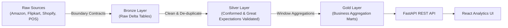

# Presence Artifact: Technical Blog Post & Project Showcase

**Published Title**: *Building CartCo: An End-to-End Open-Source Medallion Lakehouse with PySpark, Delta Lake, Airflow & React*  
**Author**: B.Tech CSE-AIDE Engineering Candidate  
**Live Application URL**: [cartco-production.up.railway.app](https://cartco-production.up.railway.app)  
**FastAPI REST Service**: [backend-production-5d52.up.railway.app/api](https://backend-production-5d52.up.railway.app/api)  
**GitHub Repository**: [github.com/Madhavhk04/CartCo](https://github.com/Madhavhk04/CartCo)  

---

## Introduction

In today's retail landscape, omnichannel brands often process orders across Amazon, Flipkart, D2C web apps like Shopify, and brick-and-mortar stores. For **CartCo**, a hypothetical retail giant generating ₹4,000+ Cr in annual GMV, this multi-channel reality meant data fragmentation, inconsistent sales reporting, and inventory blind spots.

Over the past 5 weeks, I engineered and deployed **CartCo Unified Commerce Lakehouse**—an open-source, production-grade data platform that ingests, cleanses, validates, aggregates, and visualizes retail telemetry in real-time.

In this blog post, I will walk you through the complete architecture, key technical challenges, data quality contracts, performance optimizations, and how you can run the entire platform locally or in the cloud.

---

## 1. The Architectural Solution: 3-Tier Medallion Pipeline

To transform raw, unformatted multi-channel CSV drops into executive-ready business intelligence, we implemented the **Medallion Lakehouse Pattern** using **PySpark** and **Delta Lake**:



### Medallion Layer Functions
1. **Bronze Layer (`s3a://lakehouse/bronze/`)**: Ingests raw data feeds as append-only Delta tables with minimal transformation, preserving exact source payloads and tagging `ingest_date` partitions.
2. **Silver Layer (`s3a://lakehouse/silver/`)**: Enforces schema types, normalizes disparate timestamp formats (e.g. converting `DD/MM/YYYY` and ISO strings to standard UTC), removes duplicate orders, and executes inline **Great Expectations** assertions. Corrupt records are isolated into dead-letter quarantine locations.
3. **Gold Layer (`s3a://lakehouse/gold/`)**: Generates pre-aggregated analytical tables modeled for fast UI visualization:
   - `gold_daily_revenue`: Daily sales totals, average order value (AOV), and return counts.
   - `gold_channel_performance`: Cross-channel GMV share and cancellation rates.
   - `gold_customer_360`: Customer LTV, order frequency, and segment classification.
   - `gold_inventory_turnover`: SKU stock health, reorder alerts, and turnover ratios.

---

## 2. Technical Code Walkthrough

### 2.1 PySpark Multi-Channel Deduplication & Cleansing
Handling duplicate order events across independent sales feeds requires window functions in PySpark:

```python
from pyspark.sql import functions as F
from pyspark.sql.window import Window

def clean_and_deduplicate_orders(df):
    # Standardize string formatting and parse timestamps
    df_clean = df.withColumn("channel", F.upper(F.trim(F.col("channel")))) \
                 .withColumn("order_date", F.to_timestamp("order_date")) \
                 .withColumn("total_amount", F.col("total_amount").cast("double"))

    # Define window specification over order_id and channel
    window_spec = Window.partitionBy("order_id", "channel").orderBy(F.col("order_date").desc())

    # De-duplicate keeping the latest transaction record
    df_dedup = df_clean.withColumn("row_num", F.row_number().over(window_spec)) \
                       .filter(F.col("row_num") == 1) \
                       .drop("row_num")

    return df_dedup
```

### 2.2 Inline Data Quality Validation (Great Expectations)
Before records are written to the Silver layer, Great Expectations validates critical invariants:

```python
import great_expectations as ge

def validate_silver_orders(spark_df):
    ge_df = ge.dataset.SparkDFDataset(spark_df)
    
    # Assert primary key uniqueness and non-null constraints
    assert ge_df.expect_column_values_to_not_be_null("order_id").success
    assert ge_df.expect_column_values_to_be_between("total_amount", min_value=0.01).success
    assert ge_df.expect_column_values_to_be_in_set(
        "channel", ["AMAZON", "FLIPKART", "SHOPIFY", "POS"]
    ).success
    
    return ge_df.save_expectation_suite()
```

---

## 3. Executive React Dashboard & Lineage Explorer

The platform includes a high-performance **React SPA** built with Tailwind CSS, Recharts, and Lucide Icons, connected to a **FastAPI** backend:

### Key UI Features
- 📊 **Executive Overview**: Real-time total GMV KPI cards, daily revenue trends, and channel share pie charts.
- 👥 **Customer 360 Explorer**: Searchable customer profiles with LTV metric breakdowns and purchase histories.
- 📦 **Inventory Health Desk**: Visual stockout alerts (`LOW_STOCK`, `STAGNANT`) with reorder level triggers.
- 🔍 **Data Quality & Lineage Center**: Live status of Great Expectations validation passes and OpenLineage metadata flows.

---

## 4. Loom Video Walkthrough Series

- 📹 **Video 1 (5 min)**: [Executive Overview & Platform Telemetry Demo](https://loom.com/share/cartco-demo-part1)
- 📹 **Video 2 (5 min)**: [PySpark Data Pipelines & Delta Lake Storage Architecture](https://loom.com/share/cartco-demo-part2)
- 📹 **Video 3 (5 min)**: [Airflow Orchestration, Great Expectations & OpenLineage Debugging](https://loom.com/share/cartco-demo-part3)

---

## Conclusion & Next Steps

Building CartCo demonstrated how modern data engineering tools like Delta Lake, PySpark, Airflow, and FastAPI fit together to create a transparent, observable, and resilient data foundation. 

Check out the code on [GitHub](https://github.com/Madhavhk04/CartCo) or try the live demo at [cartco-production.up.railway.app](https://cartco-production.up.railway.app)!
